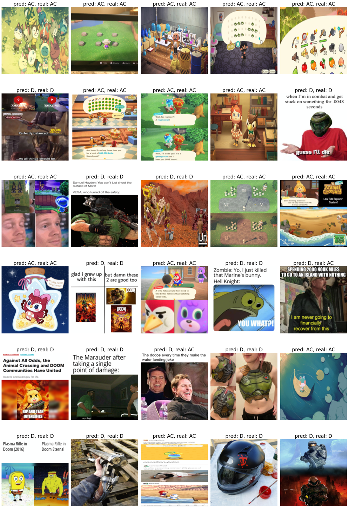

# RTG #4: Doom vs Animal Crossing

Fourth iteration of the Road To Grandmaster series. Now the task at hand is to classify images as belonging to one of two subreddits: [/r/Doom](https://www.reddit.com/r/Doom) and [/r/AnimalCrossing](https://www.reddit.com/r/AnimalCrossing). This time there's no local notebook, as I don't have a powerful GPU at my disposal. You can, however, download the data locally following the instructions below.

The strategy here was to use a pretrained CNN to differentiate between the memes from the subreddits, and Pytorch Lightning was the tool of choice to implement everything.

## Reproducing
As this time we require some GPU setup, the easiest way to reproduce the results is accessing the Kaggle notebook [here](https://www.kaggle.com/code/carlosgdcj/pytorch-lightning-cnn-0-858).
To download the data locally, you'll need to have your Kaggle API credentials set up (you need a Kaggle account):
1. At Kaggle, go to the Account tab (top right after clicking on you profile picture)
2. Click on "Create API Token" and download the `kaggle.json` file
3. Move the `kaggle.json` file to a `.kaggle` folder on you home directory:

    Linux: `~/.kaggle/kaggle.json`

    Windows: `C:\Users\<Windows-username>\.kaggle\kaggle.json`

Then run the `get_data.py` script:
``` bash
python data/get_data.py
```
## Sample predictions


## Links
* [Blog post](https://www.pacifis.org/rtg4/)
* [Kaggle notebook](https://www.kaggle.com/code/carlosgdcj/pytorch-lightning-cnn-0-858)
* [Kaggle dataset](https://www.kaggle.com/datasets/andrewmvd/doom-crossing)